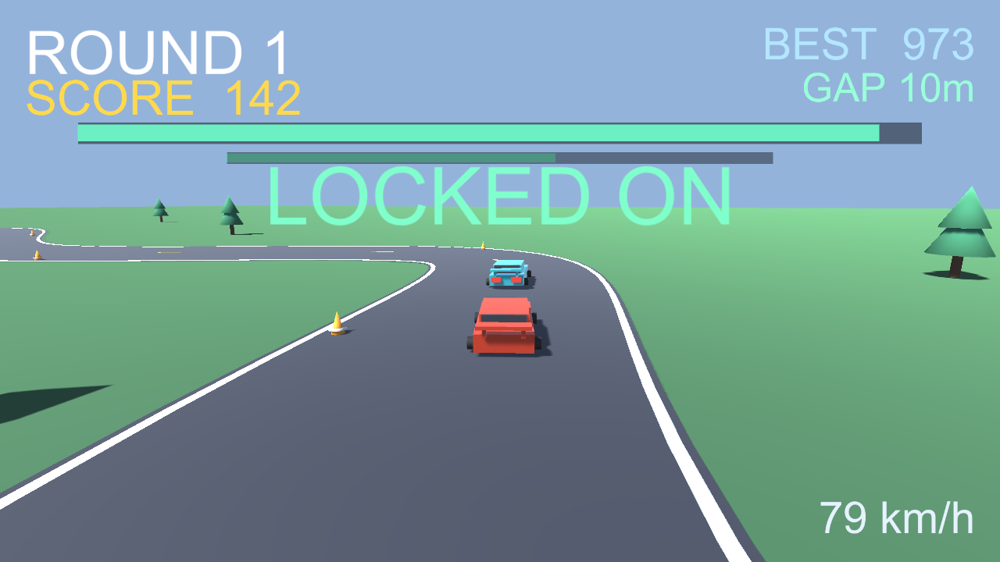

# SPIN GATE

Thread a thrown knife through the spinning gate's gap to crack the glowing core crystal — a one-tap 3D timing arcade game.

**▶ Play in browser:** https://masafykun.github.io/spin-gate/

## About
A small game built with Unity (6000.0.77f1). The C# source is under `src/`.
This repository also hosts a WebGL build, playable directly in the browser via GitHub Pages.
